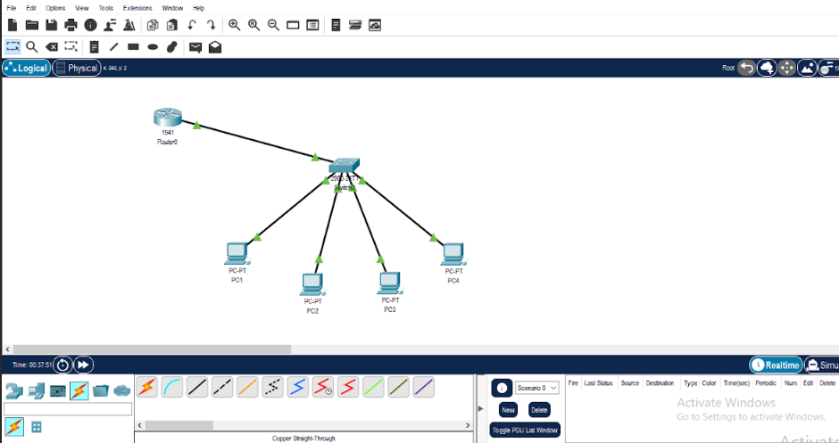
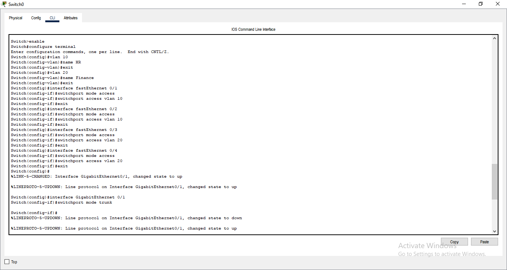
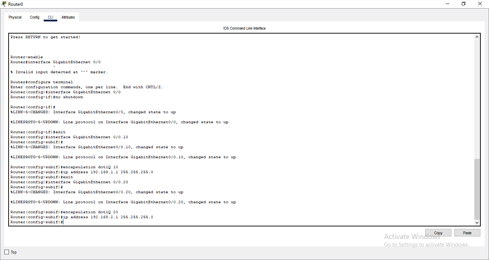
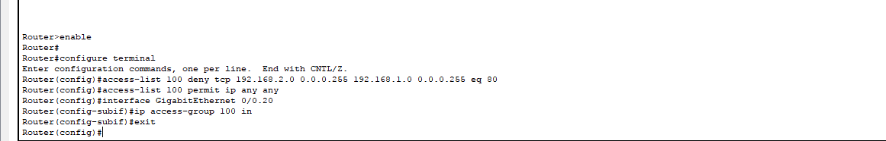
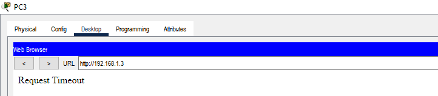
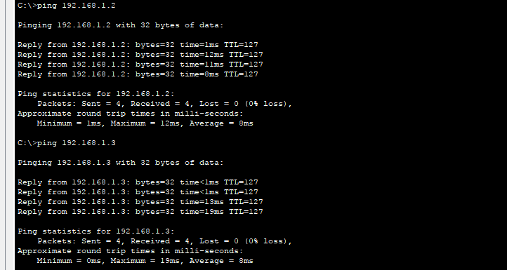

# Network Segmentation and ACL Configuration Using VLANs

## Objective

To design and implement network segmentation using VLANs and configure Access Control Lists (ACLs) to restrict specific traffic between departments within an organization.

---

## Steps followed

### Task 1: Network Creation
- Added the following devices in Cisco Packet Tracer:
  - **1 Router** (Cisco 1941)
  - **1 Switch** (Cisco 2960)
  - **4 PCs**
- PCs were named and grouped:
  - **PC1, PC2** → Human Resources (HR)
  - **PC3, PC4** → Finance
- All devices were connected using Ethernet cables to the switch.

      
---

###  Task 2: VLAN and Inter-VLAN Routing

- **VLANs Created:**
  - VLAN 10 → HR
  - VLAN 20 → Finance
- Switch ports were assigned to VLANs accordingly.

    

- **Router-on-a-Stick (Inter-VLAN Routing)** configured:
  - Subinterfaces enabled VLAN communication.
  - All PCs could ping each other after setup.

        

- **IP Addressing:**
  - **HR VLAN**
    - PC1: `192.168.1.2`
    - PC2: `192.168.1.3`
    - Gateway: `192.168.1.1`
  - **Finance VLAN**
    - PC3: `192.168.2.2`
    - PC4: `192.168.2.3`
    - Gateway: `192.168.2.1`

---

### Task 3: Implementing ACL for Security

- Configured an **Access Control List (ACL)** to:
  - **Block HTTP (port 80) traffic** from Finance VLAN to HR VLAN.
- ACL was applied to the correct router interface or subinterface.

      access-list 100 deny tcp 192.168.2.0 0.0.0.255 192.168.1.0 0.0.0.255 eq 80
      access-list 100 permit ip any any

      

---

###  Task 4: Testing the ACL

- **PC3 (Finance)** attempted to access a web server on **PC1 (HR)** — access was **blocked**.
- **ICMP (ping)** traffic was still **allowed**, confirming ACL precision.
- Successful test demonstrated controlled access between segments.

    

     

---

## Tool Used

- **Cisco Packet Tracer**
