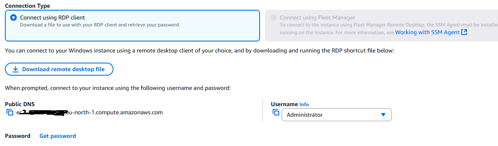
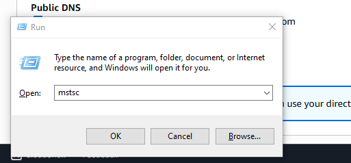
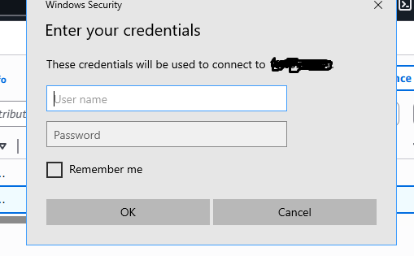
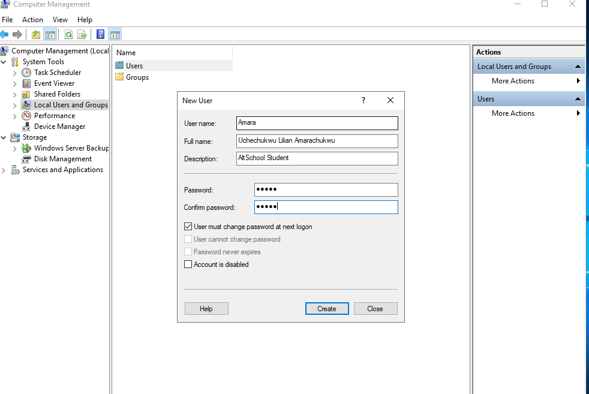
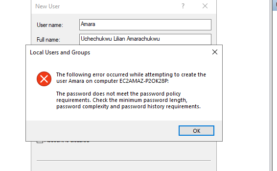
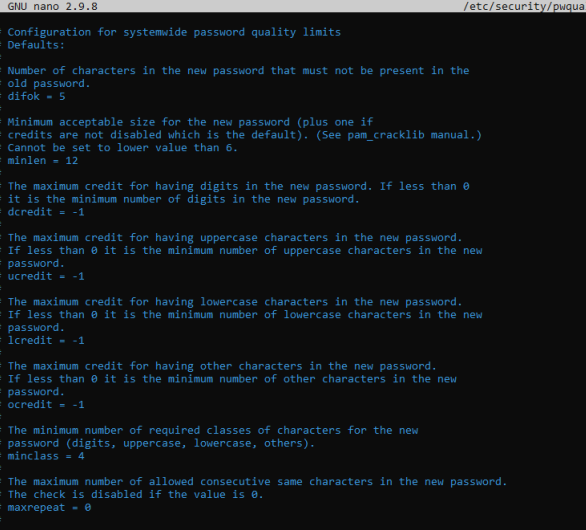
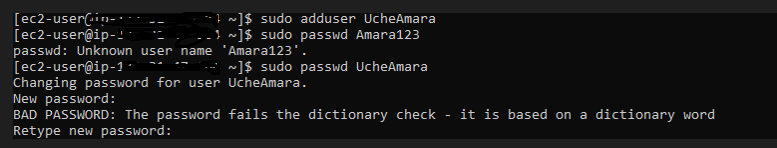

# Password Policy Enforcement on AWS EC2 

This project demonstrates how to enforce **password policies** using:

- Windows Server (via RDP)
- Amazon Linux 2


---

## Part 1: Configure Password Policy on Windows Server EC2

### Steps Taken:

1. Connected to a **Windows Server 2019 Base EC2 instance** via **RDP**.
2. Used the `.pem` key to decrypt the Windows login password:
   - Go to **Actions > Get Windows Password**
   - Use the key created during EC2 launch.

     

3. Launched RDP via:
   - `Win + R` → type `mstsc` → Enter.

    

4. Entered the **public IP address**, `Administrator` username, and decrypted password.

    

5. Once inside Windows:
   - Opened `gpedit.msc` (Local Group Policy Editor)
   - Navigated to:
     ```
     Computer Configuration > Windows Settings > Security Settings > Account Policies > Password Policy
     ```
6. Applied these settings:
   - Enforce password history: `24`
   - Maximum password age: `60 days`
   - Minimum password age: `1 day`
   - Minimum password length: `12`
   - Password must meet complexity requirements: `Enabled`

    

7. Created a user with a weak password and got an **error** – confirming the policy was effective.

    

---

## Part 2: Configure Password Policy on Amazon Linux 2 EC2

###  Steps Taken:

1. Connected to **Amazon Linux 2** via SSH from AWS console.
2. Edited the password policy config file:

    sudo nano /etc/security/pwquality.conf

3. Enforced the following rules:
   - Minimum password length: 12
   - Must contain:
   - At least 1 uppercase
   - At least 1 lowercase
   - At least 1 digit
   - At least 1 special character

    

4. Created a new user account and attempted to use a weak password.

    

✅ Weak password was rejected: Fails the dictionary check.
