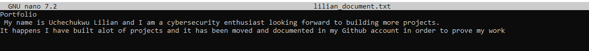
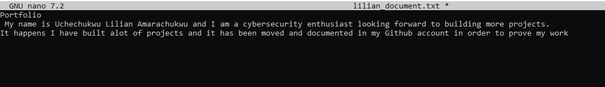
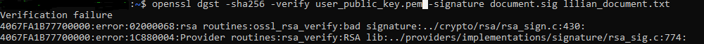

# Digital Signature Verification Using OpenSSL

##  Objective

This project simulates the use of **digital signatures** to ensure that a document:

- ✅ Was created by the legitimate sender (**Authenticity**)
- ✅ Has not been altered since it was signed (**Integrity**)
- ✅ Cannot be denied by the sender (**Non-repudiation**)

This was done using **OpenSSL** on an **AWS EC2 Ubuntu server**.

---

## Environment Setup

- **Platform:** AWS EC2 Ubuntu Server
- **Tools Used:** OpenSSL (installed via apt)

## Steps followed

### Task 1: Connected to an ubuntu server through SSH
-   Ran this command

    ```ssh -i C:\Users\hp\Downloads\ubuntu-key.pem ubuntu@(ip-address)```

 -  Updated and Installed openssl

    ```sudo apt update```
 
    ```sudo apt install openssl```

---

### Task 2: Created a Document
-   Created a single text file
    
    ```nano lilian_document.txt```

    

### Task 3: Generated a 4096-bit Private Key

    openssl genpkey -algorithm RSA -out user_private_key.pem -aes256 -pkeyopt rsa_keygen_bits:4096

-  -aes256 ensures the private key is encrypted and requires a passphrase.

-  The private key is saved as user_private_key.pem.

### Task 4: Extracted Public Key

    openssl pkey -in user_private_key.pem -pubout -out user_public_key.pem

- The public key is saved in user_public_key.pem.

- This key is used to verify signatures.


### Task 5: Signed the Document 

    openssl dgst -sha256 -sign user_private_key.pem -out document.sig lilian_document.txt

- It creates a digital signature file document.sig.

- Uses SHA-256 hashing for integrity check.

### Task 6: Verify the Document

    openssl dgst -sha256 -verify user_public_key.pem -signature document.sig lilian_document.txt

- This confirms the document has not been tampered with.

    


### Task 7: Tamper With the Document

    

-  Then ran the verification command again
   
    openssl dgst -sha256 -verify user_public_key.pem -signature document.sig lilian_document.txt

- Verification failure

    
