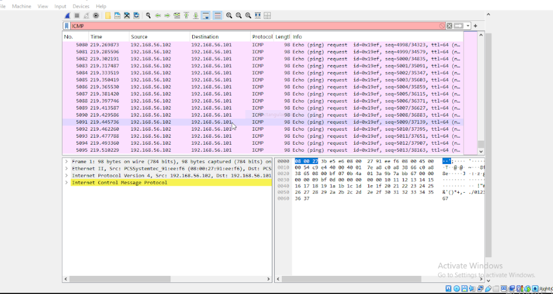
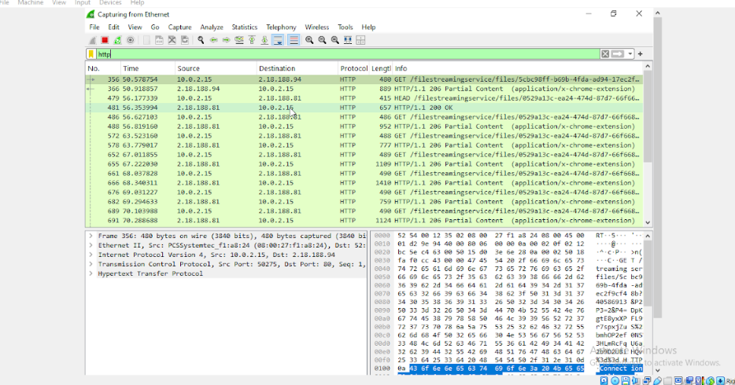

# Network Traffic Analysis and Attack Simulation with Wireshark

## Project Overview
This project involved setting up a controlled lab environment to simulate and observe network traffic, detect potential attacks, and analyze HTTP and ICMP communication using Wireshark.

The steps included environment setup, network monitoring, simulated attacks, packet capture, and analysis, followed by actionable security recommendations.

---

## Task 1: Setting Up the Investigation Environment

- Created two virtual machines: **Windows** and **Kali Linux**
- Changed the network settings to ensure both VMs were on the same virtual network
- Verified connectivity using IP address lookup and ping tests between the VMs

---

## Task 2: Monitoring for Suspicious Activity

- Installed **Wireshark** on the Windows VM
- Captured live network traffic using Wireshark
- Took screenshots of the packet captures for documentation and future reference

---

## Task 3: Simulating a Possible Attack

- Launched a basic **ICMP flood attack** from Kali using command-line tools 
          ping -f <Windows_IP>
- Captured the attack traffic in real time with Wireshark

           

---

## Task 4: Analyzing HTTP Traffic

- Accessed `http://google.com` on a browser within the Windows VM
- Captured and filtered **HTTP request packets**
- Observed unencrypted data being transmitted

          
---

## Task 5: Observations and Recommendations

### Observations in Wireshark:
- **ICMP Flood Attack**: Large volume of ICMP Echo Requests was detected
- **HTTP Traffic**: Requests were visible in plaintext, exposing sensitive metadata

### Security Recommendations:
- Use a firewall (e.g., **Windows Defender Firewall**) to block excessive ICMP requests
- Deploy **Intrusion Detection Systems (IDS)** like Snort to identify abnormal traffic
- Enforce **HTTPS** usage to encrypt HTTP data and protect user privacy

---

## Tools and Technologies Used
- Kali Linux VM
- Windows 10 VM
- Wireshark
- VirtualBox 
- Ping for ICMP traffic

---

## Outcome
This task provided hands-on experience with network packet analysis and demonstrated how attackers can exploit unsecured protocols and flood networks with malicious traffic. It highlighted the importance of proactive monitoring, detection, and mitigation techniques in cybersecurity environments.

